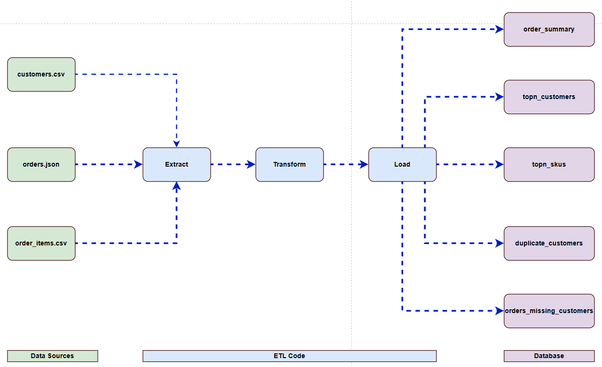
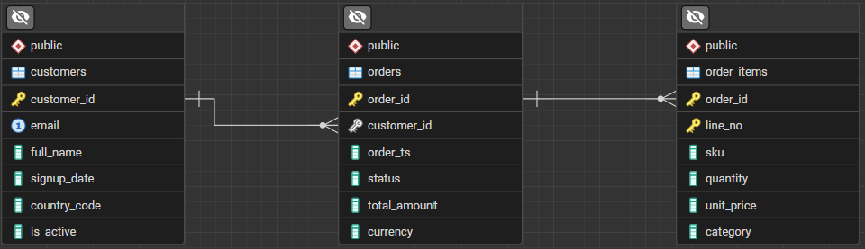

# Data Engineering Assignment – Solution

## Overview

This project implements an end-to-end data pipeline that ingests raw data from .CSV and Json files. The ingested data is than transformed and validated before it is loaded into tables in a PostgreSQL database. Furthermore, views are used to gain analytic insight such as the top N customers and perform data quality checks such as flagging orders that are not tied to a customer.

The system is illustrated as follows:

<p align="left">
  
</p>

## Data Sources

There are three data sources used in this project and they are.
- customer.csv
- order_items.csv
- orders.jsonl

The data sources can be found in the path `data/*` in this repo.

## ETL Code structure

The pipeline code is written in modules so it can be maintain, expended and debugged easily. 

The codes files structure is shown below.

```
pipeline/
├── main.py                 # Entry point (init, run)
├── config.yaml             # Configuration (DB + file paths)
├── db/
│   └── schema.sql          # Table definitions
├── etl/
│   ├── extract.py          # Data ingestion
│   ├── transform.py        # Data cleaning and validation
│   └── load.py             # Data loading
├── utils/
│   ├── db.py               # Database connection
│   └── logger.py           # Logging setup
├── sql/
│   └── views.sql           # Analytics and data quality views      
├── pipeline.log          
└── README.md               # Runtime logs
```

### Extract

The data sources a loaded into DataFrames by using the pandas library.

### Transform

The loaded DataFrames are standerdised and validated using rules. Each Dataframes is standerdized using different rules as shown below.

- Customers
    - Invalid emails are dropped.
    - Emails standerdized by putting them into lower case.
    - Duplicate emails are mitigigated by keeping the first occuring email and dropping the rest.

- Orders
    - A list us used to filter for acceptable status values.
    - Invalid timestamps are dropped.
    - Timestamps are converted into UTC time.

- Order Items
    - Records with non-posetive quantity or unit prices as dropped
    - Records that do not refference an order are dropped.

### Load

After the DataFrames are transformed, they are loaded into thier repective Postgres tables. This is achieved by the `pyscopg` library that has a `COPY` command that enables DataFrame's to be iterativel loaded into Postgres.


## Database Design

The database is designed with the following requirements.

- Primary keys are used in all three tables to ensure records are unique.
- Foreign keys keys are used to referential intergrity.
- Emails must be normalised by making them lower case and enforcing uniqueness of emails through constrains.
- Quantities and unit prices cannot be non posetive.
- Constrains are used to prevent NULL values in some fields to prevent incomplete records.

Based on the requirements, the database is designed using a star schema with one fact table and two dimension tables.
- orders (fact)
- customers (dimension)
- order item (dimension)

The table relationships are shown below.

<p align="left">
  
</p>


The image above shows the following relationships.
- customers -> orders
    - one to many
    - A single customer can have multiple orders and multiple orders can belong to one customer.
    - The customer table primary key `customer_id` links the order table by being a foreign key. 
    - Enabling data quality checks using an anti-join pattern.
- orders -> order item
    - one to many
    - A single order can have multiple items and multiple items can be in one order.
    - The tables are linked by an `order_id` primary key.

## SQL Analytics

The following views were created to analyse order matrics:

- order summary
    - Number of orders per day
    - Revenue per day
    - Average sales per day

- TopN SKU's
    - Total revenue generated per SKU.
    - Total quantaty of items sold per SKU.

- TopN Customer
    - Customers that have spent the most ordered by amount spent.


## Data Quality Monitoring

The following two views were created to ensure data quality is enforced.

- Customer Duplicate
    - It identifies duplicate customers.
    - This is achieved this by counting the number of times an email occurs and exposing those that appear more than once.
    - Expected behavour is that no records are exposes since the duplicate emails are dropped during transformation.

- Orders beloning to non existant customers
    - Identifies any orders that are not linked to a customer in the database.
    - it achieves this by implementing an anti join pattern order overs and customers.
    - The are not supposed to be any records returned because of the constrains enforced in the orders table.

## Trade-offs and Design Decisions

## Logging

Logs are used to track steps and data transfer counts in the pipeline. 

They are structured as follows:

- Timestamp
- log type
- pipeline name
- description

The logs are displayed on the terminal as well as being stored in a `pipeline.log` file in the root directory.

An example of the terminal logs are shown below.

```
(venv) PS C:\sandbox\order_pipeline> python main.py init
2026-04-13 22:22:16,742 | INFO | order_pipeline | Initialising tables
2026-04-13 22:22:16,742 | INFO | order_pipeline | Reading config file
2026-04-13 22:22:16,776 | INFO | order_pipeline | Succeful Database Connection
2026-04-13 22:22:16,826 | INFO | order_pipeline | Table Succesfuly Initialised
(venv) PS C:\sandbox\order_pipeline> python main.py run
2026-04-13 22:22:27,165 | INFO | order_pipeline | Pipeline Started
2026-04-13 22:22:27,165 | INFO | order_pipeline | Ingesting Started
2026-04-13 22:22:27,165 | INFO | order_pipeline | Reading config file
2026-04-13 22:22:27,172 | INFO | order_pipeline | Ingestion Completed
2026-04-13 22:22:27,172 | INFO | order_pipeline | Ingestion summary: Customers = 6 Orders = 10 Order Items = 12
2026-04-13 22:22:27,172 | INFO | order_pipeline | Customer Transform Started
2026-04-13 22:22:27,174 | INFO | order_pipeline | Customer Transform Completed
2026-04-13 22:22:27,174 | INFO | order_pipeline | Customer Transform = 4
2026-04-13 22:22:27,175 | INFO | order_pipeline | Orders Transform Started
2026-04-13 22:22:27,182 | INFO | order_pipeline | Orders Transform Completed
2026-04-13 22:22:27,182 | INFO | order_pipeline | Orders Transform = 5
2026-04-13 22:22:27,182 | INFO | order_pipeline | Order Items Transform Started
2026-04-13 22:22:27,183 | INFO | order_pipeline | Order Items Transform Completed
2026-04-13 22:22:27,183 | INFO | order_pipeline | Order Items Transform = 5
2026-04-13 22:22:27,184 | INFO | order_pipeline | Reading config file
2026-04-13 22:22:27,230 | INFO | order_pipeline | Succeful Database Connection
2026-04-13 22:22:27,230 | INFO | order_pipeline | customers Load Started
2026-04-13 22:22:27,233 | INFO | order_pipeline | customers Load Completed
2026-04-13 22:22:27,234 | INFO | order_pipeline | Loaded 4 customers
2026-04-13 22:22:27,234 | INFO | order_pipeline | orders Load Started
2026-04-13 22:22:27,236 | INFO | order_pipeline | orders Load Completed
2026-04-13 22:22:27,236 | INFO | order_pipeline | Loaded 5 orders
2026-04-13 22:22:27,236 | INFO | order_pipeline | order_items Load Started
2026-04-13 22:22:27,237 | INFO | order_pipeline | order_items Load Completed
2026-04-13 22:22:27,237 | INFO | order_pipeline | Loaded 5 order_items
2026-04-13 22:22:27,239 | INFO | order_pipeline | Pipeline Completed
```

